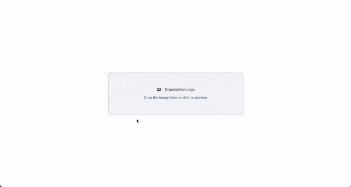
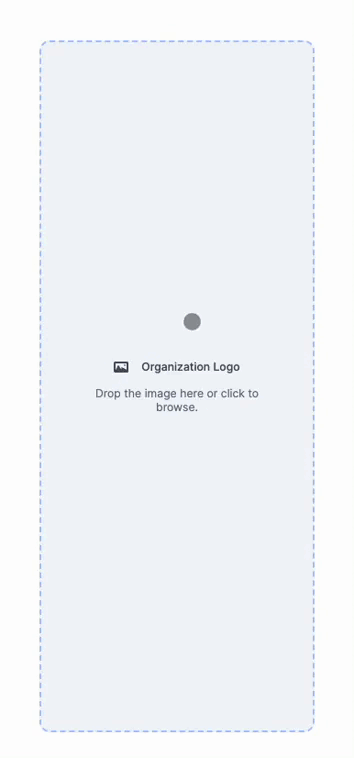
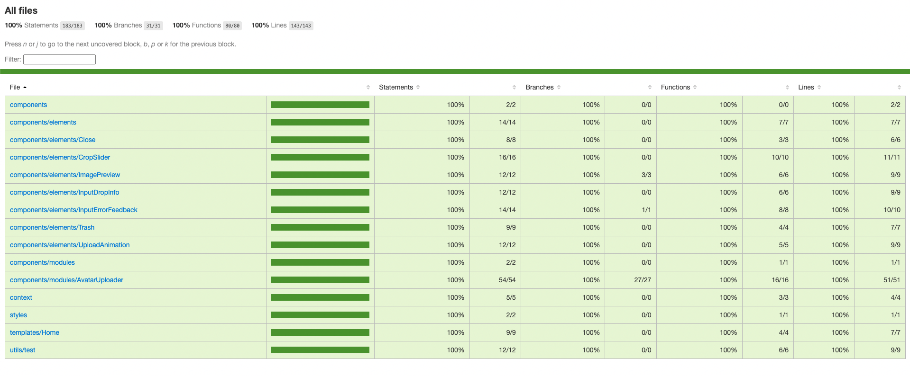

<h3 align="center">
    
    <br><br>
    <b>Avatar Uploader</b>
    <br>
</h3>

# Index

- [Purpose of the application](#purpose)
- [Technologies used](#technologies-used)
- [Results](#results)
- [How to use](#how-to-use)
- [How to contribute](#how-to-contribute)

<a id="purpose"></a>

## :bookmark: Purpose of the application

The Avatar Uploader is an application that aims to upload avatars and resize them for use in various scenarios. To access the application go to https://avatar-uploader-nine.vercel.app/

<a id="technologies-used"></a>

## :rocket: Technologies used

The project was developed using the following technologies
- [TypeScript](https://www.typescriptlang.org/)
- [React](https://reactjs.org/)
- [Next](https://nextjs.org/)
- [Styled Components](https://styled-components.com/)
- [React Images Uploading](https://github.com/vutoan266/react-images-uploading)
- [Jest](https://jestjs.io/pt-BR/)
- [React Testing Library](https://testing-library.com/docs/react-testing-library/intro/)
- [ESLint](https://eslint.org/)
- [Prettier](https://prettier.io/)
- [Husky](https://typicode.github.io/husky/#/)
- [Lint Staged](https://github.com/okonet/lint-staged)


<a id="results"></a>

## :heavy_check_mark: :computer: Web result

<h1 align="center">
    
</h1>

## :heavy_check_mark: :computer: Mobile result

<h1 align="center">
    
</h1>

## :heavy_check_mark: :computer: Test coverage

<h1 align="center">
    
</h1>

<a id="how-to-use"></a>

## :fire: How to use

- ### **Prerequisites**

  - It is **necessary** to have the **[Node.js](https://nodejs.org/en/)** installed on the machine
  - Also **need** a package manager, be the **[NPM](https://www.npmjs.com/)** or **[Yarn](https://yarnpkg.com/)**.

1. Make a clone :

```sh
  $ git clone git@github.com:lucasfelixc/avatar-uploader.git
```

2. Running the application:

```sh
  # Install the dependencies
  $ npm install or $ yarn install

  # Start the web application
  $ npm run dev or yarn dev
```

3. Testing the application:

```sh
  # To run the tests and generate coverage
  $ npm run coverage or yarn coverage
```

<a id="how-to-contribute"></a>

## :recycle: How to contribute

- Fork this repository,
- Create a branch with your feature: `git checkout -b my-feature`
- Commit your changes: `git commit -m 'feat: My new feature'`
- Push your branch: `git push origin my-feature`

---

<h4 align="center">
    By <a href="https://www.linkedin.com/in/lucasfelixdev/" target="_blank">Lucas Felix</a>
</h4>
